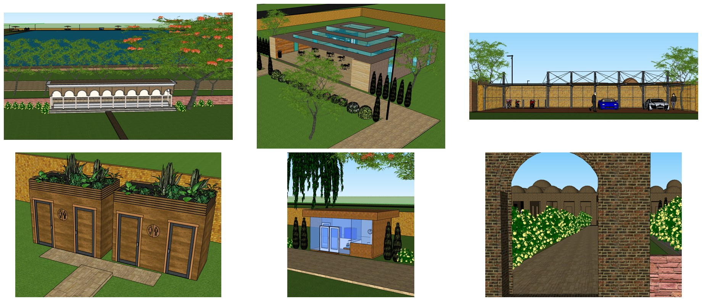
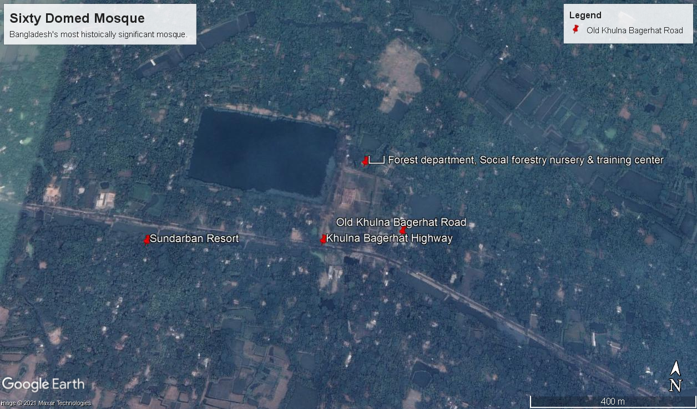
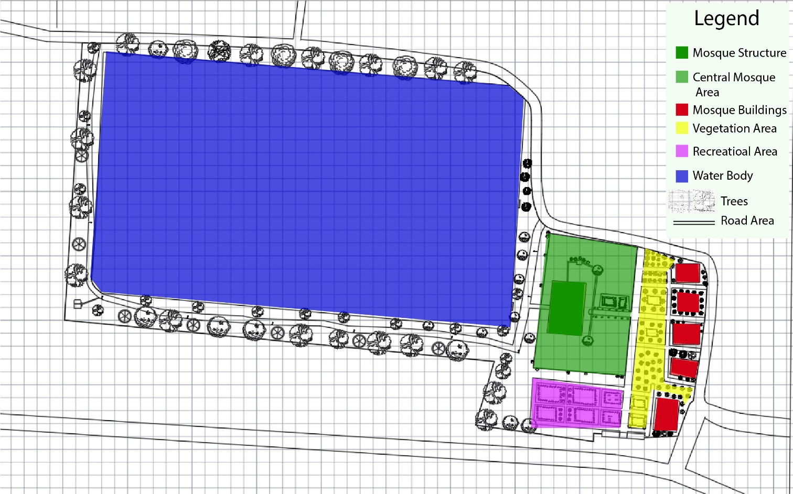
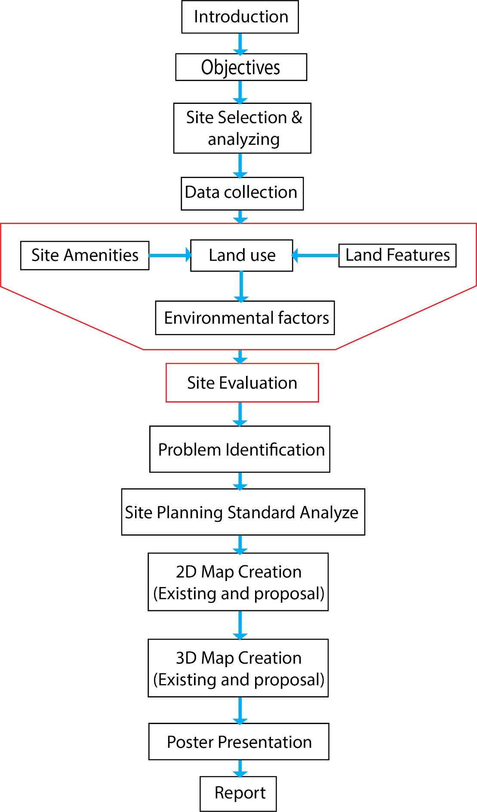
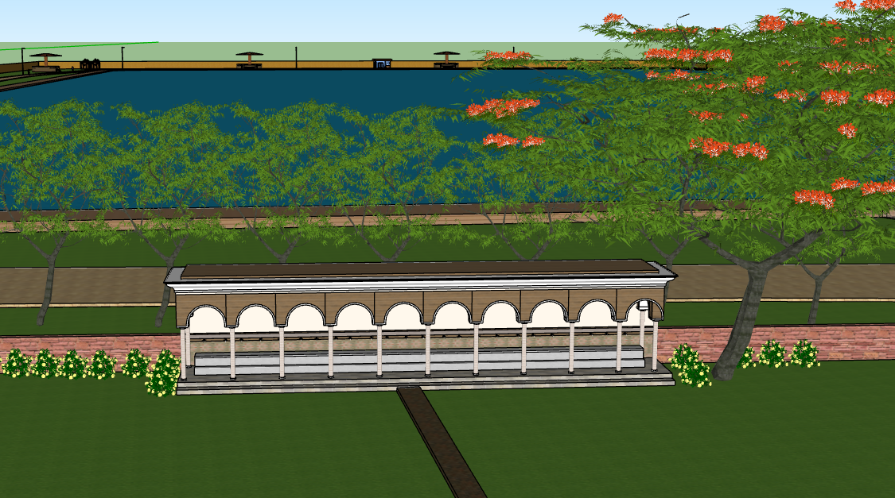
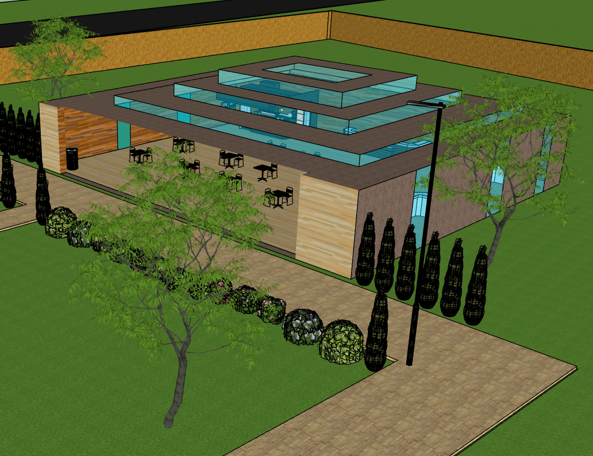
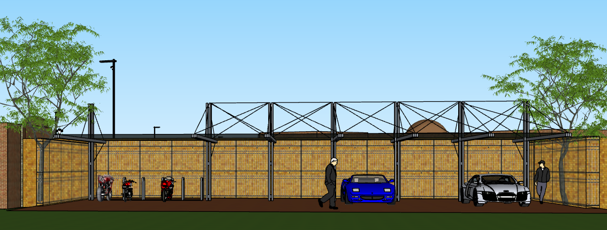

# Landscape Planning Proposal for the Sixty Dome Mosque (Shat Gambuj), Bagerhat

**URP 2252 Landscape Planning and Design Studio, Dept. of Urban and Regional Planning, KUET** · 

## Summary

The Sixty Dome Mosque is a 15th-century UNESCO World Heritage Site (listed 1985). It serves daily worshippers and large numbers of tourists, but its visitor facilities have not kept up. We visited the site, mapped its land use, sun path and wind, and inventoried existing features. We compared these with landscape standards for religious sites and found eight shortcomings: too few CCTV cameras, poor lighting, no proper wuzu (ablution) space, no cafeteria, no public toilets, no parking, no drinking water and unplanned vegetation. We then designed and modelled in 3D a heritage-sensitive proposal for each one.



## Study area

Sixty Dome Mosque complex, Bagerhat, Khulna Division (22.6745° N, 89.7418° E). The site covers 37.6 acres beside the Khulna–Bagerhat highway, about 5 km from Bagerhat town.

| Site context | Existing land use |
|---|---|
|  |  |

## Data

| Data | Source |
|---|---|
| Site layout, land use, existing features | Field visit, photographs, Google Earth |
| Sun path and wind | Site-level sun-path and seasonal wind mapping |
| Site history and heritage context | UNESCO; published literature |
| Design standards | Landscape standards for religious sites (e.g. Abu Dhabi Mosque Development Regulations), street-lighting, parking, café and toilet dimension guides cited in the report |

## Method



1. Reviewed landscape planning concepts and design standards for religious sites.
2. Surveyed the site: land use, sun path, wind, softscape (pond, gardens, trees) and hardscape (mosque, museum, roads, boundary).
3. Evaluated the site against the standards to identify shortcomings.
4. Drew 2D plans and built 3D models of the existing site and the proposals.

## Results: proposals

| Shortcoming | Proposal |
|---|---|
| Only 7 CCTV cameras inside the site | Pole-mounted cameras combined with the new street lights |
| Damaged, obsolete lighting | 10 m poles at 50 m spacing, 100 W LED |
| Temporary wuzu tap | Wuzu khana for 15 people at a time, draining to the site drainage |
| No parking | Perpendicular back-in parking beside the entrance: 5 car and 5 motorbike bays |
| No food service | Glass-and-wood cafeteria sized with dining-area standards |
| No public toilets | Two toilet blocks (male and female); the entrance block serves about 13 people at a time |
| No drinking water | Filtered drinking-water booths fed by pipeline |
| Unplanned vegetation | Planting plan: Krishnachura for shade, weeping willow along roads as a noise buffer, hibiscus and marigold for decoration |

| Wuzu khana | Cafeteria | Parking |
|---|---|---|
|  |  |  |

The sun-path, wind and other proposal images are in [`images/`](images/).

## Tools

3D modelling of the proposals · 2D site mapping · Google Earth

## Repository contents

```
images/   original maps, site photos and 3D proposal renders (unchanged); proposals-overview-collage.jpg combines six of them
```

## Contact

Chinmoy Ghosh Shuvo · Open to collaboration and knowledge sharing. Feel free to reach out on [LinkedIn](https://www.linkedin.com/in/chinmoyghosh034).
